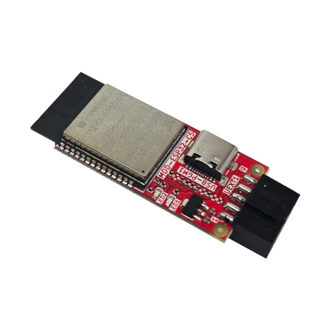

# MOD-ESP32-C5
ESP32-C5 dual band 2.4/5Ghz WiFi6 UEXT module

https://www.olimex.com/Products/IoT/ESP32-C5/MOD-ESP32-C5/open-source-hardware

## Licensee
* Hardware is released under CERN Open Hardware Licence Version 2 - Strongly Reciprocal
* Software is released under MIT Licensee
* Documentation is released under CC BY-SA 4.0